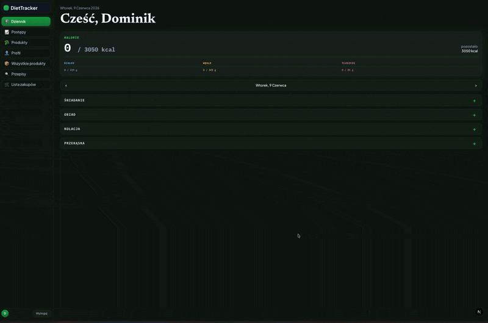

# 🥗 Diet Tracker

A full-stack diet & nutrition tracking application — plan meals, build recipes, scan products
by barcode, generate shopping lists, and track body-measurement progress over time.

Built as a portfolio project to practice **production-grade full-stack patterns**:
strict TypeScript across the whole stack, **end-to-end type safety** (Zod → OpenAPI → typed
client), a layered backend, JWT auth, automated API tests, and a real deployment.

> 🟢 **Live:** [diet-tracker-lime.vercel.app](https://diet-tracker-lime.vercel.app)
> (backend runs on Render's free tier — first request after idle can take 30–50s to cold-start)



---

## ✨ Features

- 🔐 **Authentication** — register / login with JWT stored in an httpOnly cookie, bcrypt-hashed passwords, rate limiting
- 📊 **Food diary** — log meals and track daily macros & calories, with a per-item "eaten" toggle
- 🍳 **Recipes** — build recipes from products, save your own, browse a shared catalogue
- 📷 **Barcode scanner** — scan a product (camera) and pull nutrition data from the **Open Food Facts** API
- 🛒 **Shopping list** — auto-generated from your planned meals, with **PDF export**
- 📈 **Progress tracking** — record body measurements over time, visualised with charts
- ⭐ **Favorites & recent searches** — quick access to frequently logged products
- 🖼️ **Image upload** — product images stored via Supabase Storage
- 📚 **Self-documenting API** — interactive Swagger UI generated from the same schemas that validate requests

---

## 🏗️ Architecture highlights

### End-to-end type safety

The core idea: **a single source of truth for the API contract.**

```
Zod schemas (backend)  →  generated OpenAPI spec  →  typed API client (frontend)
```

1. Request/response shapes are defined once as **Zod** schemas and used to validate input at runtime.
2. Those schemas are turned into an **OpenAPI** spec (`zod-to-openapi`), served as Swagger docs.
3. The frontend generates a fully **typed client** from that spec (`openapi-typescript` + `openapi-fetch`).

The result: change the contract on the backend and the frontend **stops compiling** until it's
updated — no drift, no guessing, no manually-maintained types.

The backend follows a **layered architecture** — `routes → controllers → services → Prisma` —
with centralised error handling and middleware for auth, rate limiting and validation.

### First-party auth cookies across two domains

Frontend (Vercel) and backend (Render) are different origins, which breaks a naive httpOnly-cookie
setup: a cookie set by the backend lands on the `onrender.com` domain and the frontend's route
protection can't read it back (and browsers increasingly block third-party cookies anyway).

Fix: Next.js **rewrites** `/api/v1/*` to the Render backend server-side (`next.config.ts`). The
browser only ever talks to the Vercel origin, so the `Set-Cookie` response lands **first-party**
on the frontend's own domain — no CORS, no third-party cookie problem.

---

## 🧰 Tech stack

| | |
|---|---|
| **Frontend** | Next.js, React, TypeScript, Tailwind CSS, Zustand, React Hook Form + Zod, Recharts, react-zxing (barcode), jsPDF |
| **Backend** | Node.js, Express, TypeScript, Prisma ORM, PostgreSQL, JWT + bcrypt, express-rate-limit, Zod |
| **API contract** | zod-to-openapi, Swagger UI, openapi-typescript, openapi-fetch |
| **Testing** | Vitest + Supertest (integration tests for the API) |
| **Tooling** | ESLint, Prettier, Husky, Nodemon, ts-node |

---

## 🚀 Getting started

Want to see it running without any setup? Use the **live version** above instead.
The steps below are for running it locally.

### Prerequisites
- Node.js 18+
- A local PostgreSQL database (production uses Supabase, but development runs against `localhost`)
- (optional) A Supabase project — only needed for product-image upload

### 1. Clone

```bash
git clone https://github.com/DominikLorenc/diet-tracker.git
cd diet-tracker
```

### 2. Backend

```bash
cd backend
npm install
cp .env.example .env          # then fill in the values
npm run prisma:generate
npm run prisma:devMigrate      # create the database schema
npm run dev                    # starts the API on http://localhost:4000
```

### 3. Frontend

```bash
cd frontend
npm install
cp .env.example .env.local         # then fill in the values
npm run dev                        # starts the app on http://localhost:3000
```

### 4. (optional) Regenerate the typed API client

With the backend running:

```bash
cd frontend
npm run generate:api
```

---

## 📚 API documentation

With the backend running, the interactive Swagger UI is available at:

```
http://localhost:4000/api/v1/docs
```

---

## 🧪 Tests

```bash
cd backend
npm test
```

Integration tests (Vitest + Supertest) cover authentication, users, recipes, the food diary and products.

---

## 📁 Project structure

```
.
├── backend/
│   └── src/
│       ├── controllers/   # request handlers
│       ├── services/      # business logic
│       ├── routes/        # route definitions
│       ├── middleware/    # auth, rate limiting, error handling
│       ├── schemas/       # Zod schemas (single source of truth)
│       ├── __tests__/     # Vitest + Supertest
│       └── ...
└── frontend/
    ├── app/               # Next.js app router (pages + colocated components)
    ├── store/             # Zustand stores (user, toasts)
    ├── schemas/           # Zod schemas for React Hook Form
    ├── src/lib/api/       # generated, typed API client (openapi-typescript)
    └── proxy.ts           # route-protection middleware (reads the JWT cookie)
```

---

## ☁️ Deployment

| | |
|---|---|
| **Frontend** | Vercel — Next.js preset, root directory `frontend` |
| **Backend** | Render — free web service, root directory `backend` |
| **Database** | Supabase Postgres (Session pooler) |

The frontend never calls the Render URL directly — it proxies `/api/v1/*` through its own
Next.js rewrite (see "Architecture highlights" above), so the auth cookie stays first-party
and no CORS configuration is needed between the two origins.

---

## 📝 Note

Personal portfolio project, built to explore full-stack architecture and tooling.
Feedback and questions are welcome.
